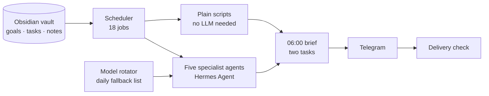

# Life-OS

> A personal AI operating system that runs 24/7 on a Raspberry Pi and sends one message a day: what to do next.

> [!NOTE]
> The source and the notes it reads are private, because it runs on my own life. This repo explains what it does and how it's built.

**Status:** running daily since May 2026.

## What it does

Notes, goals and tasks live in an Obsidian vault of 132 notes. Life-OS reads that vault, runs 18 scheduled jobs, hands work to five specialist agents and sends one Telegram message at **06:00**: a brief with **exactly two tasks**, each tied to a quarterly goal.

The constraint is deliberate. A to-do list with twenty items is easy to generate and easy to ignore. Two tasks that each move a goal forward are harder to pick and harder to dodge.

## How it works

- **The vault is the memory.** Goals, quarterly outcomes and tasks are plain Markdown, so everything the system knows can be read, edited and versioned by hand.
- **Agents for judgement, scripts for everything else.** Only jobs that genuinely need reasoning go to an agent.
- **Claude Code skills** cover the interactive side, such as weekly reviews and spotting patterns across notes.

## Built to stay up

Running something every day for months surfaces failures that a demo never does.

- **Delivery is tracked, not just execution.** It once had a silent outage where every job fired but nothing arrived. Now delivery is checked end to end, so a green tick can't hide a broken system.
- **Models disappear, so it plans for that.** A daily model rotator refreshes the list of models to use, and it refuses to save a new list unless at least three fallbacks survive.
- **Only spend tokens on judgement.** Jobs that need no judgement run as plain scripts, so half the schedule costs nothing to run.

## Stack

Python · Hermes Agent · Raspberry Pi 5 · Obsidian · Telegram Bot API · Claude Code
