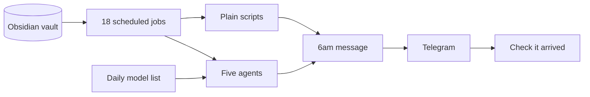

# Life-OS

My own AI assistant. It runs on a Raspberry Pi 5, all day, every day, and has done since May 2026.

The code and my notes are private, so this repo is a write-up of what it does and how it works.

## What it does

All my goals, tasks and notes live in an Obsidian vault of 132 notes. Life-OS reads it, runs 18 jobs on a schedule and passes anything that needs some thinking to five agents. Then at 6am it sends me one Telegram message with two tasks for the day, each one tied to a goal for the quarter.

It's limited to two on purpose, because a long to-do list is easy to ignore.

## How it works

- The vault is its memory. It's all just markdown, so I can read and change anything it knows.
- Only jobs that need some judgement go to an agent. The rest are plain scripts.
- I also use Claude Code in the vault for things like weekly reviews.

## Things that went wrong

- It had a silent outage. The jobs were running and everything looked fine, but nothing was being sent. Now it checks that the message actually arrived, not just that the job ran.
- Models get removed or stop working. A daily job refreshes which models it uses, and it won't save the new list unless at least three fallbacks still work.
- About half the jobs are plain scripts, so those cost nothing to run.

## Stack

Python, Hermes Agent, Raspberry Pi 5, Obsidian, Telegram
